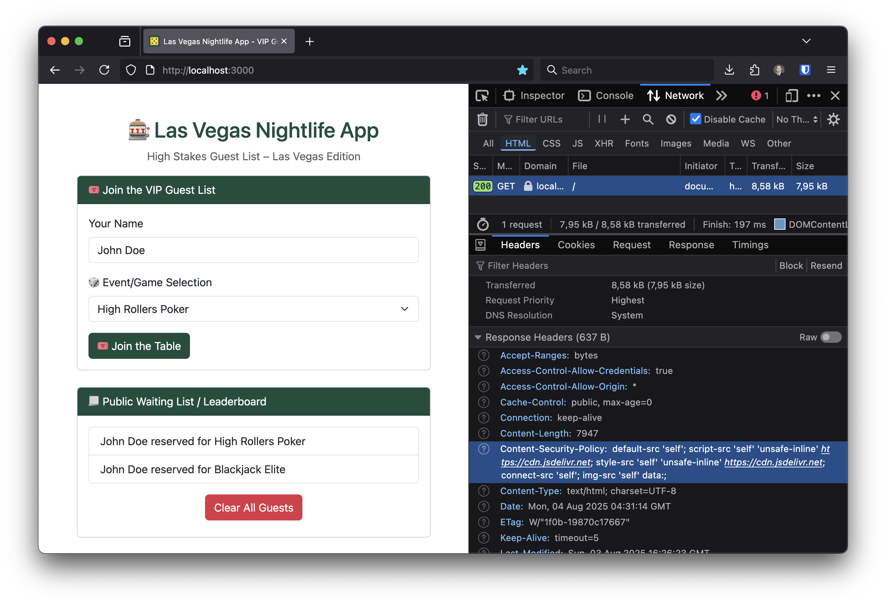

# Las Vegas Nightlife App - High Stakes Guest List



## Prerequisites

### Option 1: Using Node.js
- [Node.js](https://nodejs.org/) installed on your system.

### Option 2: Using Docker
- [Docker](https://www.docker.com/) installed on your system.


---

## Setup

### Option 1: Run with Node.js

1. **Clone this repository**:
   ```bash
   git clone https://github.com/JavanXD/LasVegasNightlifeApp-Workshop.git
   cd LasVegasNightlifeApp-Workshop/src
   ```

2. **Install dependencies**:
   ```bash
   npm install
   ```

3. **Start the server**:
   ```bash
   npm start
   ```

4. **Open the app in your browser**:  
   `http://localhost:3000`

---

### Option 2: Run with Docker

1. **Clone this repository**:
   ```bash
   git clone https://github.com/JavanXD/LasVegasNightlifeApp-Workshop.git
   cd LasVegasNightlifeApp-Workshop/src
   ```

2. **Start the application using Docker Compose**:
   ```bash
   docker-compose up
   ```

3. **Edit files locally**:
   - Any changes to `app.js` or files in the `public/` directory will be automatically reflected in the app.

4. **Open the app in your browser**:  
   `http://localhost:3000`

5. **Stop the application**:
   ```bash
   docker-compose down
   ```

---

## Additional Notes

- **Node.js**: Use this method if you prefer a native development environment.
- **Docker**: Recommended if you want a containerised environment without installing Node.js on your system.


## Files and Folders

- [`CHALLENGES.md`](./CHALLENGES.md): Contains the activities for the workshop.
- `src/`: Contains the code for the Las Vegas Nightlife application.
    - `src/public/`: Contains the static front-end assets.
    - `src/app.js`: Contains the back-end code.
- `attacks/`: Contains the attack scripts for the challenges.
- [`detect-insecure-practices-helper/`](./detect-insecure-practices-helper/README.md): Contains the helper script to detect insecure practices using `grep` and a custom **Semgrep** rule. (used for [Challenge 4](./CHALLENGE_4.md))

## 📨 Get in Touch

Have questions, feedback, or just want to connect? Reach out to me through any of these platforms:  
- **[bsky](https://bsky.app/profile/javanrasokat.bsky.social)**  
- **[X](https://x.com/javanrasokat)**  
- **[LinkedIn](https://www.linkedin.com/in/javan-rasokat)**  


